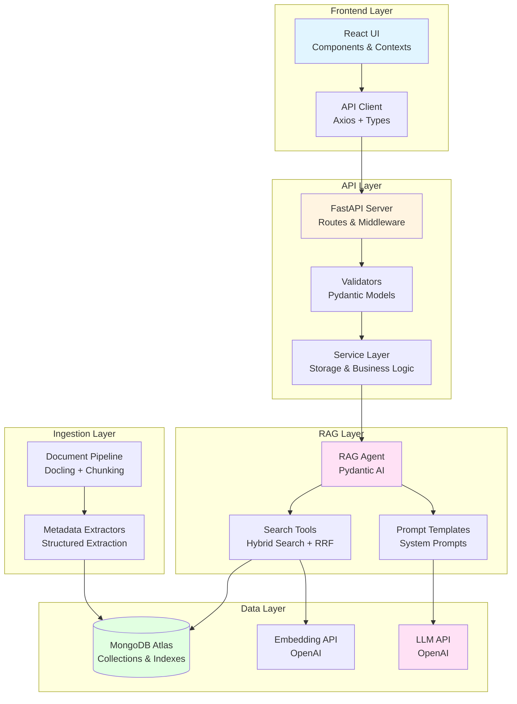
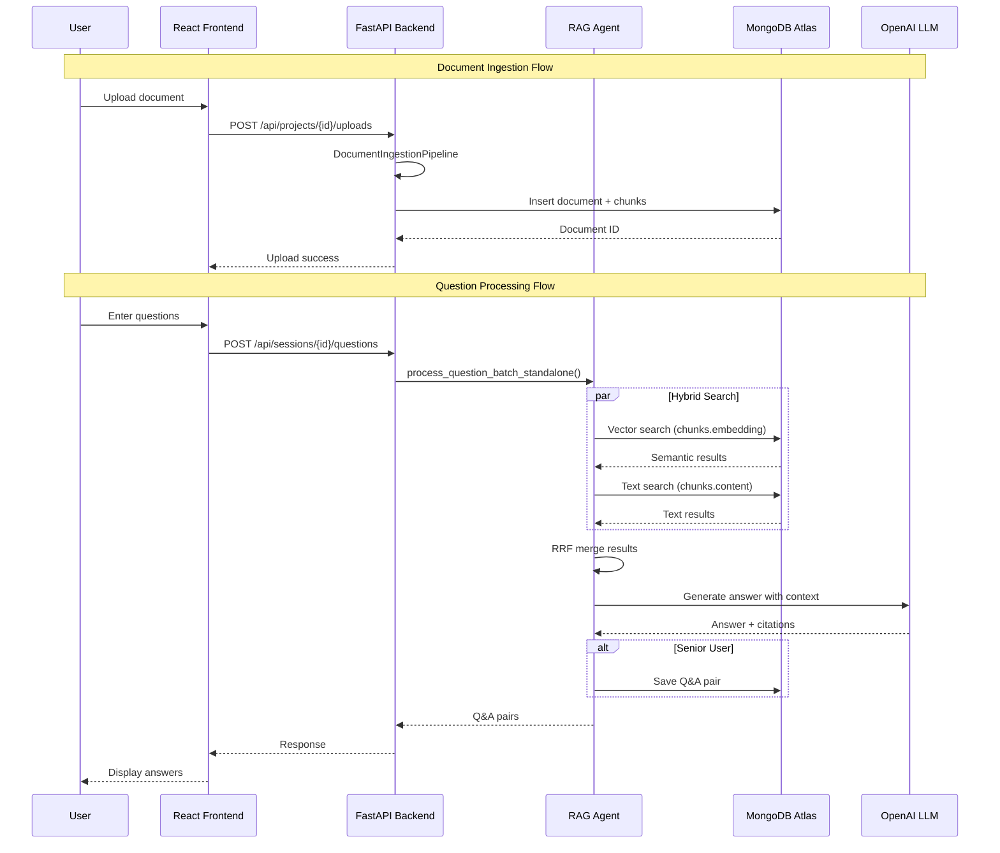
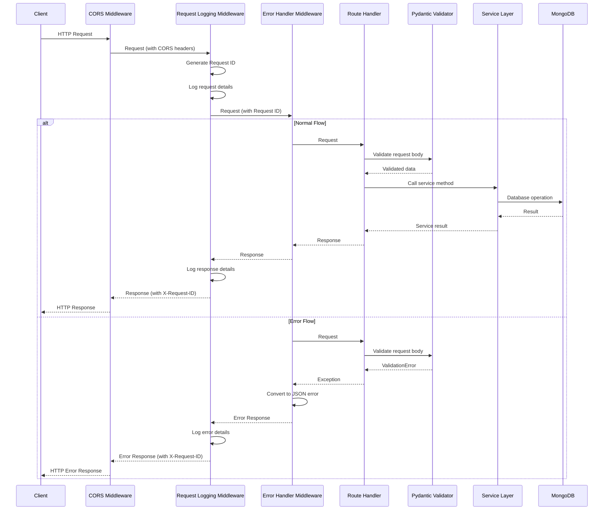
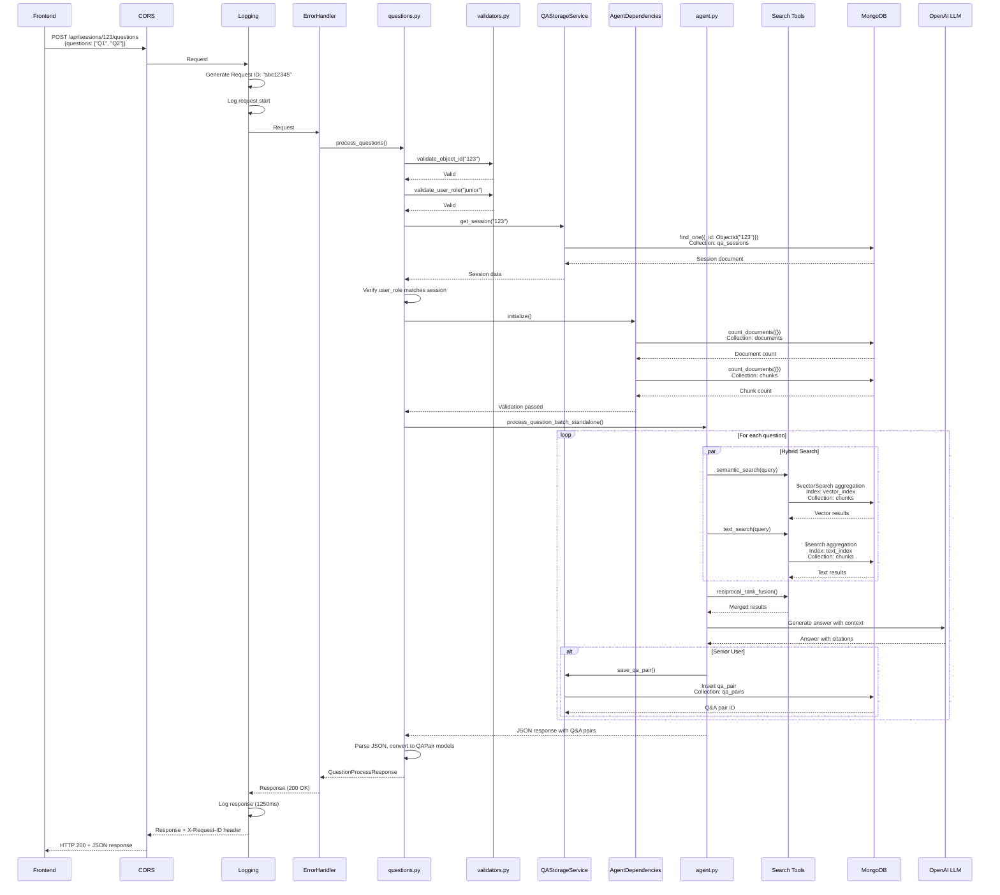
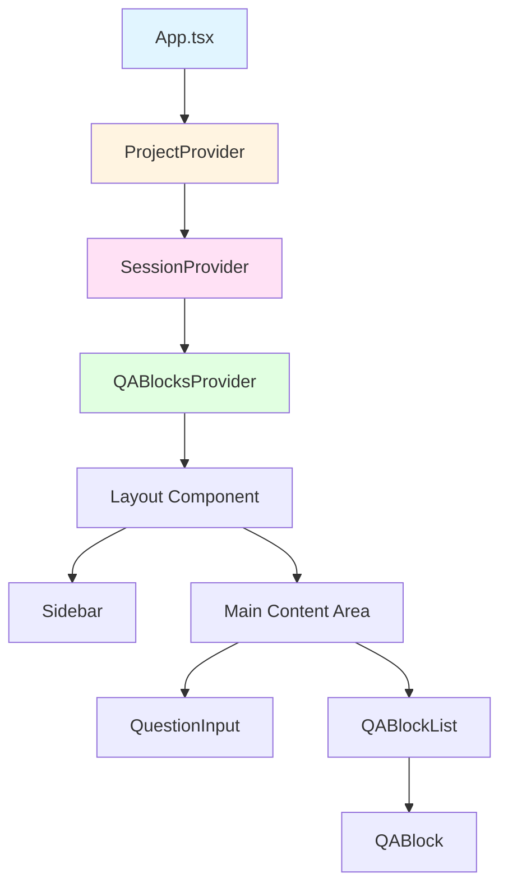
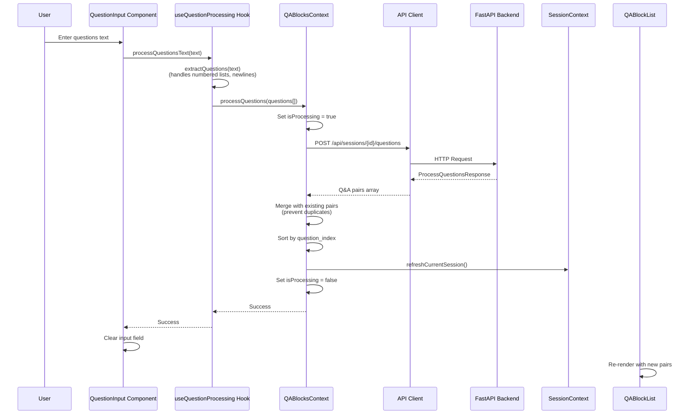
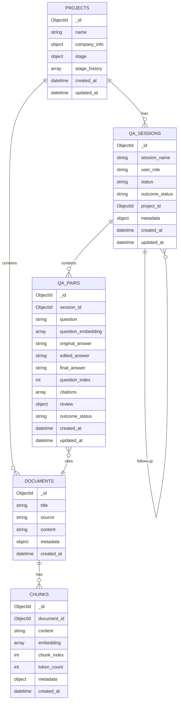

# Architecture Deep Dive

This document provides a comprehensive technical overview of the MongoDB RAG Agent architecture, covering all major components and their interactions.

## Table of Contents

1. [System Overview](#system-overview)
2. [Backend API (FastAPI)](#backend-api-fastapi)
3. [Frontend (React/Vite)](#frontend-reactvite)
4. [Ingestion Pipeline](#ingestion-pipeline)
5. [RAG/Agent Orchestration](#ragagent-orchestration)
6. [Data Model](#data-model)

---

## System Overview

### End-to-End Architecture

The system follows a layered architecture with clear separation of concerns:



### Component Interaction Flow



---

## Backend API (FastAPI)

### Overview

The backend is built with **FastAPI** and provides a REST API for the React frontend. It handles session management, question processing, project management, and document ingestion.

**Entry Point**: `src/api/main.py`

### Application Structure

```python
# FastAPI app initialization
app = FastAPI(
    title="MongoDB RAG Q&A API",
    description="REST API for Q&A system with MongoDB RAG backend",
    version="1.0.0",
    lifespan=lifespan  # Startup/shutdown lifecycle management
)
```

### Request Lifecycle

Every request flows through the following middleware stack:

```
1. CORS Middleware (FastAPI built-in)
   └─> Allows cross-origin requests (configured for all origins in dev)

2. Request Logging Middleware (custom)
   └─> Generates unique request ID
   └─> Logs request method, path, query params, headers (sanitized)
   └─> Logs response status, timing, size
   └─> Adds X-Request-ID header to response

3. Error Handler Middleware (custom)
   └─> Catches all exceptions
   └─> Converts to appropriate HTTP responses
   └─> Handles validation errors, not found errors, server errors

4. Route Handler
   └─> Validates request (Pydantic models)
   └─> Calls service layer
   └─> Returns response
```

**Sequence Diagram**:



### Middleware Stack

#### 1. CORS Middleware

**Location**: `src/api/main.py`

```python
app.add_middleware(
    CORSMiddleware,
    allow_origins=["*"],  # Configure appropriately for production
    allow_credentials=True,
    allow_methods=["*"],
    allow_headers=["*"],
)
```

**Purpose**: Enables cross-origin requests from the frontend.

#### 2. Request Logging Middleware

**Location**: `src/api/middleware.py` → `request_logging_middleware()`

**Features**:
- Generates unique request ID (8-character UUID) for tracing
- Logs request details: method, path, query params, headers (sanitized), body (sanitized)
- Logs response details: status code, processing time, response size
- Adds `X-Request-ID` header to response for client-side tracing

**Request ID**: Stored in `ContextVar` (`request_id_var`) for access throughout request lifecycle.

**Sanitization**: Removes sensitive fields (passwords, API keys, tokens) from logs.

#### 3. Error Handler Middleware

**Location**: `src/api/middleware.py` → `error_handler_middleware()`

**Exception Handling**:

| Exception Type | HTTP Status | Response Format |
|----------------|-------------|-----------------|
| `APIException` (custom) | Custom status | `{"error": "ErrorType", "message": "...", "status_code": N}` |
| `RequestValidationError` (FastAPI) | 422 | `{"error": "ValidationError", "message": "...", "detail": [...]}` |
| `ValidationError` (Pydantic) | 400 | `{"error": "ValidationError", "message": "...", "detail": [...]}` |
| `InvalidId` (MongoDB) | 400 | `{"error": "ValidationError", "message": "Invalid ID format: ..."}` |
| `ValueError` (with "not found") | 404 | `{"error": "NotFoundError", "message": "..."}` |
| `ValueError` (other) | 400 | `{"error": "ValidationError", "message": "..."}` |
| `Exception` (unhandled) | 500 | `{"error": "InternalServerError", "message": "An unexpected error occurred", "request_id": "..."}` |

**Custom Exceptions** (`src/api/exceptions.py`):
- `APIException`: Base exception class
- `ValidationError`: 400 Bad Request
- `NotFoundError`: 404 Not Found
- `ConflictError`: 409 Conflict
- `UnauthorizedError`: 401 Unauthorized
- `InternalServerError`: 500 Internal Server Error
- `ServiceUnavailableError`: 503 Service Unavailable

### Router Organization

The API is organized into **6 route modules**:

#### 1. Sessions Router (`/api/sessions`)

**File**: `src/api/routes/sessions.py`

**Endpoints**:
- `POST /api/sessions` - Create session
- `GET /api/sessions` - List sessions (with pagination)
- `GET /api/sessions/{session_id}` - Get session by ID
- `PUT /api/sessions/{session_id}/outcome` - Mark session outcome
- `POST /api/sessions/{session_id}/follow-up` - Create follow-up session

**Dependencies**: `QAStorageService`, `CompanyExtractor`

#### 2. Questions Router (`/api/sessions`)

**File**: `src/api/routes/questions.py`

**Endpoints**:
- `POST /api/sessions/{session_id}/questions` - Process questions and generate answers

**Key Features**:
- Validates session exists and user_role matches
- Validates document/chunk existence before processing
- Calls `process_question_batch_standalone()` from `src/agent.py`
- Parses JSON response and converts to `QAPair` models
- Comprehensive logging with request ID tracking

**Dependencies**: `QAStorageService`, `AgentDependencies`, `process_question_batch_standalone`

#### 3. Q&A Pairs Router (`/api`)

**File**: `src/api/routes/qa_pairs.py`

**Endpoints**:
- `GET /api/sessions/{session_id}/qa-pairs` - Get all Q&A pairs for session
- `PUT /api/qa-pairs/{qa_pair_id}` - Update Q&A pair answer
- `PUT /api/qa-pairs/{qa_pair_id}/rating` - Update Q&A pair rating

**Dependencies**: `QAStorageService`

#### 4. Projects Router (`/api/projects`)

**File**: `src/api/routes/projects.py`

**Endpoints**:
- `POST /api/projects` - Create project
- `GET /api/projects` - List projects
- `GET /api/projects/{project_id}` - Get project by ID
- `PUT /api/projects/{project_id}/stage` - Update project stage
- `GET /api/projects/{project_id}/stage-options` - Get stage transition options
- `POST /api/projects/{project_id}/uploads` - Upload document to project

**Dependencies**: `ProjectStorageService`, `DocumentIngestionPipeline`

#### 5. Export Router (`/api/sessions`)

**File**: `src/api/routes/export.py`

**Endpoints**:
- `POST /api/sessions/{session_id}/export?format={markdown|pdf|docx}` - Export session

**Dependencies**: `ExportService`, `QAStorageService`

#### 6. Admin Router (`/api/admin`)

**File**: `src/api/routes/admin.py`

**Endpoints**:
- `POST /api/admin/background-tasks/check-auto-success` - Manually trigger auto-success check
- `GET /api/admin/background-tasks/status` - Get background task status

**Dependencies**: `BackgroundTaskScheduler` (from `src/api/main.py`)

### Request/Response Models

All request/response models are defined in `src/api/models.py` using **Pydantic**.

**Key Models**:

| Model | Purpose | Key Fields |
|-------|---------|------------|
| `SessionCreateRequest` | Create session | `name`, `user_role`, `company_info`, `project_id` |
| `SessionResponse` | Session data | `id`, `session_name`, `user_role`, `status`, `outcome_status`, `project_id`, `metadata` |
| `QuestionProcessRequest` | Process questions | `questions[]`, `session_id`, `user_role`, `include_history` |
| `QuestionProcessResponse` | Processing result | `questions_processed`, `qa_pairs[]` |
| `QAPair` | Q&A pair data | `_id`, `session_id`, `question`, `original_answer`, `edited_answer`, `final_answer`, `citations[]`, `rating_good`, `review` |
| `ProjectCreateRequest` | Create project | `name`, `company_info` |
| `ProjectResponse` | Project data | `id`, `name`, `company_info`, `stage`, `stage_history[]` |
| `Citation` | Citation data | `citation_number`, `title`, `source`, `document_id`, `document_title`, `similarity`, `chunk_id` |

**Validation**:
- Field validators ensure data integrity (e.g., `user_role` must be "junior" or "senior")
- String length limits enforced (e.g., session name max 500 chars, questions max 10000 chars)
- ObjectId validation for MongoDB IDs
- List length limits (e.g., max 100 questions per request)

### Validation Layer

**Location**: `src/api/validators.py`

**Helper Functions**:
- `validate_object_id(id_value, resource_name)` - Validates MongoDB ObjectId format
- `validate_user_role(user_role)` - Validates user_role is "junior" or "senior"
- `validate_outcome_status(outcome_status)` - Validates outcome_status is "successful", "unsuccessful", or None
- `validate_determined_by(determined_by)` - Validates determined_by is "user" or "auto"
- `validate_questions_list(questions, max_questions)` - Validates questions list format and length

**Usage**: Called in route handlers before processing requests.

### Background Tasks

**Location**: `src/services/background_tasks.py`

**Class**: `BackgroundTaskScheduler`

**Purpose**: Manages periodic background tasks (e.g., auto-marking successful sessions).

**Lifecycle**:
1. **Startup**: Initialized in `lifespan()` context manager (`src/api/main.py`)
2. **Configuration**: Controlled via `Settings.qa_background_check_enabled` and `Settings.qa_background_check_interval_hours`
3. **Execution**: Runs periodic task (`check_auto_success_sessions()`) at configured interval
4. **Shutdown**: Stopped gracefully on application shutdown

**Tasks**:
- **Auto-Success Check**: Periodically checks for sessions that should be auto-marked as successful:
  - Sessions that have been exported
  - Older than `qa_auto_success_days`
  - Have no follow-up sessions
  - Don't already have an outcome status

**Status Endpoint**: `/api/admin/background-tasks/status` returns:
```json
{
  "enabled": true,
  "running": true,
  "last_execution_time": "2026-01-23T10:00:00",
  "next_execution_time": "2026-01-23T14:00:00",
  "execution_count": 42,
  "error_count": 0,
  "check_interval_hours": 4,
  "auto_success_days": 7
}
```

### Application Lifecycle

**Startup** (`lifespan()` context manager):
1. Load settings from environment
2. Initialize `BackgroundTaskScheduler`
3. Start background tasks (if enabled)
4. Log startup completion

**Shutdown**:
1. Stop background task scheduler
2. Cleanup resources
3. Log shutdown completion

### Health Check Endpoint

**Endpoint**: `GET /health`

**Location**: `src/api/main.py`

**Response**:
```json
{
  "status": "healthy" | "degraded" | "unhealthy",
  "service": "qa-api",
  "readiness": "ready" | "not_ready",
  "background_tasks": {
    "enabled": true,
    "running": true,
    "last_execution": "2026-01-23T10:00:00",
    "next_execution": "2026-01-23T14:00:00"
  },
  "dependencies": {
    "mongodb": {"status": "connected"},
    "documents": {"status": "available", "count": 150},
    "chunks": {"status": "available", "count": 5000, "embeddings": "present"},
    "vector_index": {"status": "available"}
  }
}
```

**Checks**:
- MongoDB connection
- Document count
- Chunk count
- Embedding presence
- Vector index existence

**Readiness States**:
- `ready`: All dependencies available, vector index present
- `not_ready`: Missing documents, chunks, or embeddings
- `degraded`: Vector index missing (but documents/chunks exist)

### Logging Configuration

**Location**: `src/api/logging_config.py`

**Features**:
- Centralized logging setup
- Request ID filtering (adds request ID to all log records)
- Sensitive data sanitization (removes passwords, API keys, tokens)
- File rotation (10MB max, 5 backups)
- Console and file handlers
- Configurable log level via `LOG_LEVEL` environment variable

**Log Format**:
```
2026-01-23 10:00:00 - src.api.routes.questions - INFO - [abc12345] - Request started: POST /api/sessions/123/questions
```

### Service Layer

The backend uses a **service layer pattern** to abstract database operations:

| Service | Location | Purpose |
|---------|----------|---------|
| `QAStorageService` | `src/services/qa_storage.py` | Session and Q&A pair CRUD operations |
| `ProjectStorageService` | `src/services/project_storage.py` | Project CRUD and stage management |
| `ExportService` | `src/services/export_service.py` | Session export to Markdown/PDF/DOCX |
| `CompanyExtractor` | `src/services/company_extractor.py` | Extract company info from text |
| `OutcomeTracker` | `src/services/outcome_tracker.py` | Track and update session outcomes |

**Pattern**: Each service:
1. Initializes MongoDB connection on `initialize()`
2. Provides async methods for operations
3. Cleans up connection on `cleanup()`
4. Uses `Settings` for configuration

### Error Handling Flow

```
Request → Middleware → Route Handler
                           ↓
                    Validation (Pydantic)
                           ↓
                    Service Layer
                           ↓
                    MongoDB Operations
                           ↓
                    Response
                           ↓
                    Error Handler Middleware (if exception)
                           ↓
                    JSON Error Response
```

**Error Response Format**:
```json
{
  "error": "ErrorType",
  "message": "Human-readable error message",
  "status_code": 400,
  "detail": "Additional details (optional)",
  "request_id": "abc12345"
}
```

### Request Flow Example

**Example**: `POST /api/sessions/{session_id}/questions`



**Step-by-Step Flow**:

1. **Request arrives**
   - CORS middleware allows cross-origin request

2. **Request logging middleware**
   - Generates request ID: "abc12345"
   - Logs: "Request started: POST /api/sessions/123/questions"
   - Logs request body (sanitized)

3. **Error handler middleware** (waits for response)

4. **Route handler**: `process_questions()`
   - Validates session_id format (ObjectId)
   - Validates user_role
   - Loads session from MongoDB via `QAStorageService`
   - Validates user_role matches session
   - Validates documents/chunks exist via `AgentDependencies`
   - Calls `process_question_batch_standalone()` from `src/agent.py`
   - Parses JSON response
   - Converts to QAPair models
   - Returns `QuestionProcessResponse`

5. **Response logging middleware**
   - Logs: "Request completed: POST /api/sessions/123/questions -> 200"
   - Logs processing time: "1250ms"
   - Adds X-Request-ID header

6. **Response sent to client**

### Environment Variables

**Required** (see `src/settings.py`):
- `MONGODB_URI` - MongoDB connection string
- `MONGODB_DATABASE` - Database name
- `OPENAI_API_KEY` - OpenAI API key for embeddings/LLM
- `QA_BACKGROUND_CHECK_ENABLED` - Enable background tasks (default: `true`)
- `QA_BACKGROUND_CHECK_INTERVAL_HOURS` - Background task interval (default: `4`)
- `LOG_LEVEL` - Logging level (default: `INFO`)

**Optional**:
- `QA_AUTO_SUCCESS_DAYS` - Days before auto-marking successful (default: `7`)
- `MONGODB_COLLECTION_*` - Collection name overrides

---

## Frontend (React/Vite)

### Overview

The frontend is a **React 18** application built with **Vite** and **TypeScript**. It provides a single-page application (SPA) interface for managing projects, sessions, and Q&A interactions. The UI uses **Tailwind CSS** for styling and follows a context-based state management pattern.

**Entry Point**: `frontend/src/main.tsx` → `frontend/src/App.tsx`

**Build Tool**: Vite (configured in `frontend/vite.config.ts`)

### Application Structure

```
frontend/src/
├── main.tsx                 # React entry point
├── App.tsx                  # Root component with context providers
├── index.css                # Global styles (Tailwind)
├── api/
│   ├── client.ts           # Axios API client with interceptors
│   └── types.ts            # TypeScript type definitions
├── contexts/
│   ├── ProjectContext.tsx  # Project state management
│   ├── SessionContext.tsx   # Session state management
│   ├── QABlocksContext.tsx # Q&A pairs state management
│   └── index.ts            # Context exports
├── components/
│   ├── Layout.tsx          # Main layout with sidebar
│   ├── QuestionInput.tsx   # Question entry form
│   ├── QABlockList.tsx     # List of Q&A pairs
│   ├── QABlock.tsx         # Individual Q&A pair display
│   ├── ProjectSelector.tsx # Project selection dropdown
│   ├── SessionSelector.tsx # Session selection dropdown
│   └── ...                 # Other UI components
└── hooks/
    └── useQuestionProcessing.ts  # Question extraction logic
```

### Context Architecture

The frontend uses **React Context API** for state management with three main contexts:

#### 1. ProjectContext (`frontend/src/contexts/ProjectContext.tsx`)

**Purpose**: Manages project selection and project-related operations.

**State**:
- `currentProject: Project | null` - Currently selected project
- `isLoading: boolean` - Loading state for async operations
- `error: string | null` - Error message state

**Methods**:
- `listProjects()` - Fetch all projects
- `loadProject(projectId)` - Load a specific project
- `createProject(name)` - Create a new project
- `updateStage(projectId, mode, event, toStage, note?)` - Update project stage
- `uploadDocument(projectId, file)` - Upload document to project
- `clearError()` - Clear error state

**Usage**: Wrapped around entire app in `App.tsx` (outermost provider).

#### 2. SessionContext (`frontend/src/contexts/SessionContext.tsx`)

**Purpose**: Manages Q&A session selection and session-related operations.

**State**:
- `currentSession: QASession | null` - Currently selected session
- `userRole: 'junior' | 'senior'` - Current user role (affects Q&A persistence)
- `isLoading: boolean` - Loading state
- `error: string | null` - Error message state

**Methods**:
- `createSession(name, companyInfo?, projectId?)` - Create a new session
- `loadSession(sessionId)` - Load a specific session
- `refreshCurrentSession()` - Silently refresh session metadata
- `loadParentSession()` - Load parent session (for follow-up sessions)
- `listSessions(limit?, skip?)` - List sessions with pagination
- `updateUserRole(role)` - Update user role
- `markOutcome(outcome)` - Mark session outcome (successful/unsuccessful)
- `clearError()` - Clear error state

**Usage**: Wrapped inside `ProjectProvider` in `App.tsx`.

**Key Behavior**:
- `userRole` determines if Q&A pairs are persisted (senior) or ephemeral (junior)
- `refreshCurrentSession()` is called after question processing to update review summaries

#### 3. QABlocksContext (`frontend/src/contexts/QABlocksContext.tsx`)

**Purpose**: Manages Q&A pairs for the current session.

**State**:
- `qaPairs: QAPair[]` - Array of Q&A pairs (sorted by `question_index`)
- `isProcessing: boolean` - Processing state for question submission
- `error: string | null` - Error message state

**Methods**:
- `processQuestions(questions[])` - Process questions and generate answers
- `updateAnswer(qaPairId, editedAnswer)` - Update Q&A pair answer (optimistic update)
- `updateRating(qaPairId, ratingGood)` - Update Q&A pair rating (optimistic update with rollback)
- `loadQAPairs()` - Load all Q&A pairs for current session
- `clearError()` - Clear error state

**Dependencies**: Requires `SessionContext` (uses `currentSession` and `userRole`).

**Key Behavior**:
- Automatically refreshes session metadata after `processQuestions()` completes
- Merges new Q&A pairs with existing ones (prevents duplicates)
- Sorts Q&A pairs by `question_index` for consistent ordering

### Component Hierarchy



**Component Flow**:

1. **App.tsx**: Root component that wraps providers in order (Project → Session → QABlocks)
2. **Layout**: Main layout component with sidebar and main content area
3. **Sidebar**: Contains project/session selectors, context info, stage workflow visualization
4. **QuestionInput**: Form for entering questions (supports numbered lists, newlines)
5. **QABlockList**: Displays all Q&A pairs for current session (auto-loads on session change)
6. **QABlock**: Individual Q&A pair with answer editing, rating, citations, review display

### Question Processing Flow



**Step-by-Step Flow**:

1. **User Input**: User enters questions in `QuestionInput` textarea (supports numbered lists like "1. Question", newlines)
2. **Question Extraction**: `useQuestionProcessing` hook extracts questions from text:
   - Splits by newlines
   - Removes leading numbers and formatting (e.g., "1. ", "1) ")
   - Filters empty lines
3. **Context Call**: `QABlocksContext.processQuestions()` called with question array
4. **API Request**: POST to `/api/sessions/{session_id}/questions` with:
   - `questions[]` array
   - `user_role` from session context
   - `include_history: true` (for Q&A history search)
5. **State Update**: On success:
   - Merges new Q&A pairs with existing (prevents duplicates by `_id`)
   - Sorts by `question_index`
   - Refreshes session metadata (for review summary updates)
6. **UI Update**: `QABlockList` re-renders with new Q&A pairs

### API Client Architecture

**Location**: `frontend/src/api/client.ts`

**Features**:

1. **Axios Instance**: Configured with base URL from `VITE_API_BASE_URL` env var
2. **Request Interceptor**: 
   - Generates unique request ID for tracing
   - Logs request details (method, URL, params, data)
   - Tracks request start time
3. **Response Interceptor**:
   - Logs response details (status, duration, data size)
   - Extracts `X-Request-ID` header from response
4. **Error Handling**:
   - Converts Axios errors to `APIError` instances
   - Classifies error types (network, validation, not_found, etc.)
   - Provides user-friendly error messages
5. **Retry Logic**: 
   - Automatically retries retryable errors (network, 5xx, 503, 429)
   - Max 3 retries with 1-second delay
   - Uses `retryRequest()` wrapper function

**Error Types** (`frontend/src/api/types.ts`):

- `APIError` class with:
  - `type`: Error classification (`network`, `validation`, `not_found`, `conflict`, `unauthorized`, `server`, `unknown`)
  - `status`: HTTP status code
  - `message`: Error message
  - `getUserMessage()`: User-friendly error message
  - `isRetryable()`: Whether error should be retried

### Type System

**Location**: `frontend/src/api/types.ts`

**Key Types**:

- `QASession`: Session data structure
- `QAPair`: Q&A pair with citations, ratings, reviews
- `Project`: Project data with stage information
- `Citation`: Citation reference to source document
- `ProcessQuestionsRequest/Response`: Question processing API types
- `APIError`: Error handling class

**Type Mapping**: Frontend types match backend Pydantic models (`src/api/models.py`):
- Field names match exactly (e.g., `_id`, `session_name`, `user_role`)
- Optional fields use `T | null` or `T | undefined`
- Date fields are ISO datetime strings
- Enums match backend validation (e.g., `"junior" | "senior"`)

### State Management Patterns

#### Optimistic Updates

The frontend uses optimistic updates for better UX:

1. **Answer Editing** (`QABlocksContext.updateAnswer()`):
   - UI updates immediately with edited answer
   - API call made in background
   - On error, error message displayed (but UI stays updated)

2. **Rating Updates** (`QABlocksContext.updateRating()`):
   - UI updates immediately with new rating
   - API call made in background
   - On error, **rolls back** to previous rating value

#### Automatic Data Loading

- **Q&A Pairs**: `QABlockList` component automatically loads Q&A pairs when `currentSession` changes (via `useEffect`)
- **Session Refresh**: After question processing, session metadata is refreshed to update review summaries

#### Error Handling

- **Context-level**: Each context maintains `error` state and `clearError()` method
- **Component-level**: Components display errors via `ErrorAlert` component
- **API-level**: All errors wrapped in `APIError` with user-friendly messages
- **Retry logic**: Automatic retry for network/server errors (up to 3 attempts)

### UI Components

#### Layout Component (`frontend/src/components/Layout.tsx`)

**Structure**:
- Header with title and user role toggle
- Sidebar (collapsible on mobile) with:
  - Context section (company, project, stage)
  - Stage workflow visualization (when project selected)
  - Project management (selector, creator, uploads)
  - Session management (selector, creator)
  - Session details (company info, status, outcome, export)
- Main content area (renders children)

**Responsive**: Sidebar collapses on mobile with hamburger menu

#### QuestionInput Component (`frontend/src/components/QuestionInput.tsx`)

**Features**:
- Multi-line textarea with auto-resize
- Character count display
- Question extraction via `useQuestionProcessing` hook
- Validation (requires session, non-empty questions)
- Loading state during processing
- Error display

**Question Format Support**:
- Numbered lists: "1. Question", "2. Question"
- Newline-separated: One question per line
- Mixed formats

#### QABlockList Component (`frontend/src/components/QABlockList.tsx`)

**Features**:
- Auto-loads Q&A pairs when session changes
- Displays review summary banner (if missing info exists)
- Renders `QABlock` for each Q&A pair
- Empty state when no questions
- Loading spinner during initial load

#### QABlock Component (`frontend/src/components/QABlock.tsx`)

**Features**:
- Question display
- Answer display (original or edited)
- Answer editing (senior users only)
- Rating buttons (good/bad/clear, senior users only)
- Citation list with document links
- Review display (verdict, summary, missing info)
- Outcome status badge

### Hooks

#### useQuestionProcessing (`frontend/src/hooks/useQuestionProcessing.ts`)

**Purpose**: Extracts questions from text input and processes them.

**Methods**:
- `extractQuestions(text)`: Parses text into question array
  - Handles numbered lists ("1. Question", "2. Question")
  - Handles newline-separated questions
  - Removes leading numbers and formatting
- `processQuestionsText(text)`: Extracts questions and calls `QABlocksContext.processQuestions()`

**Returns**:
- `processQuestionsText`: Main processing function
- `extractQuestions`: Question extraction utility
- `isProcessing`: Processing state
- `error`: Error state

### Environment Configuration

**Environment Variables** (`frontend/.env`):

- `VITE_API_BASE_URL`: Backend API base URL (default: `http://localhost:8000`)

**Build Configuration** (`frontend/vite.config.ts`):

- React plugin
- TypeScript support
- Path aliases (if configured)
- Dev server proxy (if configured)

### Development Workflow

**Start Development Server**:
```bash
cd frontend
npm install
npm run dev
```

**Build for Production**:
```bash
npm run build
```

**Output**: `frontend/dist/` directory with static assets

### Key Design Decisions

1. **Context-Based State**: Avoids prop drilling, provides centralized state management
2. **Optimistic Updates**: Improves perceived performance, better UX
3. **Type Safety**: Full TypeScript coverage ensures type safety between frontend and backend
4. **Error Handling**: Comprehensive error handling at API, context, and component levels
5. **Automatic Refresh**: Session metadata refreshes after question processing to show updated review summaries
6. **Question Extraction**: Handles various input formats (numbered lists, newlines) for user convenience

### Integration Points

**Backend API**: See `docs/technical/FRONTEND_BACKEND_CONTRACT.md` for complete API contract

**Key Endpoints Used**:
- `POST /api/sessions` - Create session
- `GET /api/sessions/{id}` - Get session
- `POST /api/sessions/{id}/questions` - Process questions
- `GET /api/sessions/{id}/qa-pairs` - Get Q&A pairs
- `PUT /api/qa-pairs/{id}` - Update answer
- `PUT /api/qa-pairs/{id}/rating` - Update rating
- `POST /api/projects` - Create project
- `GET /api/projects` - List projects
- `POST /api/projects/{id}/uploads` - Upload document

---

## Ingestion Pipeline

The ingestion pipeline processes documents from various formats into searchable chunks stored in MongoDB. For comprehensive technical documentation, see **[Ingestion Pipeline Deep Dive](INGESTION_PIPELINE_DEEP_DIVE.md)**.

### Quick Overview

The pipeline consists of five main stages:

1. **File Reading & Conversion**: Converts documents (PDF, DOCX, PPTX, XLSX, HTML, audio) to markdown using Docling
2. **Metadata Extraction**: Extracts structured metadata from headers, filenames, and content analysis
3. **Chunking**: Splits documents into semantically coherent chunks using Docling's HybridChunker
4. **Embedding**: Generates vector embeddings (1536-dim) using OpenAI-compatible APIs
5. **Persistence**: Stores documents and chunks in MongoDB with denormalized metadata for efficient filtering

**Key Components**:
- **Entry Point**: `src/ingestion/ingest.py` → `DocumentIngestionPipeline`
- **Conversion**: `docling.document_converter.DocumentConverter`
- **Metadata**: `src/ingestion/metadata_extractor.py` (tax interpretation, filename patterns, content analysis)
- **Chunking**: `src/ingestion/chunker.py` → `DoclingHybridChunker` (with section-aware mode for tax interpretations)
- **Embedding**: `src/ingestion/embedder.py` → `EmbeddingGenerator` (batch processing, 100 chunks/batch)
- **Storage**: MongoDB collections `documents` and `chunks` (with denormalized metadata)

**Supported Formats**:
- **Documents**: PDF, DOCX, DOC, PPTX, PPT, XLSX, XLS, HTML, HTM, MD, MARKDOWN
- **Text**: TXT (UTF-8, Latin-1)
- **Audio**: MP3, WAV, M4A, FLAC (transcribed via Whisper Turbo)

**MongoDB Collections**:
- `documents`: Full document content + metadata (source of truth)
- `chunks`: Searchable chunks with embeddings + denormalized metadata (for filtering)

See **[INGESTION_PIPELINE_DEEP_DIVE.md](INGESTION_PIPELINE_DEEP_DIVE.md)** for complete technical details.

---

## RAG/Agent Orchestration

*[To be documented by Agent_D_RAG]*

---

## Data Model

This section documents the MongoDB data model, including all collections, their schemas, relationships, and required indexes.

### Database Overview

**Database Name**: Configurable via `MONGODB_DATABASE` environment variable (default: `rag_db`)

**Collections**:
1. `documents` - Source documents with full content
2. `chunks` - Searchable document chunks with embeddings
3. `projects` - Project management and stage tracking
4. `qa_sessions` - Q&A sessions with user roles and outcomes
5. `qa_pairs` - Q&A pairs with questions, answers, and citations

### Collection Schemas

#### 1. Documents Collection (`documents`)

**Purpose**: Source of truth for complete documents. Stores full document content and metadata.

**Schema**:
```python
{
    "_id": ObjectId,                    # MongoDB document ID
    "title": str,                       # Document title (extracted or filename)
    "source": str,                      # Relative file path or source identifier
    "content": str,                     # Full document content (markdown format)
    "metadata": {
        # File metadata
        "file_path": str,               # Original file path
        "file_size": int,                # Content length in characters
        "ingestion_date": str,           # ISO datetime of ingestion
        "line_count": int,               # Number of lines
        "word_count": int,               # Number of words
        "section_count": int,            # Number of H2 sections
        
        # Tax interpretation metadata (if applicable)
        "id_informacji": str,           # Unique document identifier
        "kategoria": str,               # Document category
        "status": str,                  # Document status
        "data_publikacji": str,         # Publication date
        "tytul_teza": str,              # Main question/title (most important)
        "autor": str,                   # Author name
        "data_wydania": str,            # Issue date
        "sygnatura": str,               # Document signature
        "slowa_kluczowe": List[str],    # Keywords array
        
        # Filename metadata (if structured filename)
        "document_date": str,           # Date from filename (YYYY-MM-DD)
        "document_time": str,           # Time from filename (HHMM)
        "document_type": str,           # Document type code (e.g., "KDIP2", "KDIB1-3")
        "document_number": str,         # Document number
        "document_year": str,           # Year
        "revision": str,                # Revision number
        "author": str,                  # Author initials
        "parsed_from_filename": bool,   # Flag indicating filename parsing
        
        # Content analysis metadata
        "outcome_status": str,          # "successful" | "unsuccessful" (if detected)
        "outcome_paragraphs": List[str], # Paragraphs containing outcome indicators
        "interpretation_stance": str,   # "positive" | "partial" | "negative"
        "stance_evidence": List[str],   # Evidence paragraphs for stance
        
        # Project association
        "project_id": ObjectId,        # Optional: Link to projects collection
    },
    "created_at": datetime              # Ingestion timestamp
}
```

**Key Fields**:
- `title`: Used for document identification and citation display
- `source`: File path used for document retrieval and citation
- `content`: Full markdown content for document-level operations
- `metadata`: Denormalized into chunks for efficient filtering

**Relationships**:
- One-to-many with `chunks` (via `chunks.document_id`)

#### 2. Chunks Collection (`chunks`)

**Purpose**: Searchable units for RAG queries. Contains document chunks with vector embeddings and denormalized metadata for filtering.

**Schema**:
```python
{
    "_id": ObjectId,                    # MongoDB chunk ID
    "document_id": ObjectId,            # Foreign key to documents._id
    "content": str,                     # Chunk text content (with context)
    "embedding": List[float],          # Vector embedding (1536-dim for text-embedding-3-small)
    "chunk_index": int,                 # Position in document (0-based)
    "token_count": int,                 # Token count for this chunk
    "metadata": {
        # Chunk-specific metadata
        "title": str,                   # Document title (denormalized)
        "source": str,                  # Document source (denormalized)
        "chunk_method": str,            # "hybrid" | "section_aware_hybrid" | "simple_fallback"
        "total_chunks": int,            # Total number of chunks in document
        "token_count": int,             # Token count (duplicate of top-level)
        
        # Section metadata (for section-aware chunks)
        "section_type": str,            # "header" | "przepis" | "zagadnienie" | "interpretation" | "analysis"
        "section_title": str,           # Section heading text
        "section_index": int,            # Section position in document
        "is_header": bool,              # Boolean flag
        "is_main_content": bool,        # Boolean flag
        
        # Denormalized document metadata (for filtering)
        "project_id": ObjectId,        # Project association
        "document_type": str,           # Document type code
        "document_date": str,           # Document date
        "id_informacji": str,           # Document ID
        "sygnatura": str,               # Document signature
        "interpretation_stance": str,   # Interpretation stance
        "slowa_kluczowe": List[str],    # Keywords array
        "author": str,                  # Author name/initials
        
        # Embedding metadata
        "embedding_model": str,         # Model name used (e.g., "text-embedding-3-small")
        "embedding_generated_at": str,  # ISO datetime timestamp
    },
    "created_at": datetime              # Ingestion timestamp
}
```

**Key Fields**:
- `embedding`: Vector representation for semantic search (MUST be Python list, not string!)
- `document_id`: Foreign key for joining with documents collection
- `metadata`: Denormalized document metadata enables efficient filtering without joins

**Relationships**:
- Many-to-one with `documents` (via `document_id`)

**Denormalization Strategy**:
Key document metadata fields are copied into each chunk's `metadata` to enable fast filtering without requiring `$lookup` joins. This trade-off increases storage but significantly improves query performance.

#### 3. Projects Collection (`projects`)

**Purpose**: Project management and stage tracking for organizing work and documents.

**Schema**:
```python
{
    "_id": ObjectId,                    # MongoDB project ID
    "name": str,                        # Project name (1-200 chars)
    "company_info": {
        "name": str,                    # Company name
        "context": str,                 # Company description/context
        # ... other company fields
    },
    "created_at": datetime,              # Creation timestamp
    "updated_at": datetime,              # Last update timestamp
    "stage": {
        "key": str,                     # Current stage key (e.g., "prep_docs", "qa_review")
        "updated_at": datetime          # Stage update timestamp
    },
    "stage_history": [
        {
            "at": datetime,             # Timestamp of change
            "from": str | None,          # Previous stage (null for initial creation)
            "to": str,                  # New stage
            "event": str,               # Event type ("create", "update", "rollback")
            "note": str | None,         # Optional note explaining change
            "by": str | None            # Who made the change (if tracked)
        }
    ]
}
```

**Key Fields**:
- `stage.key`: Current project stage (validated against stage workflow)
- `stage_history`: Audit trail of all stage transitions

**Relationships**:
- One-to-many with `qa_sessions` (via `qa_sessions.project_id`)
- One-to-many with `documents` (via `documents.metadata.project_id`)

#### 4. QA Sessions Collection (`qa_sessions`)

**Purpose**: Q&A sessions with user roles, outcomes, and follow-up session tracking.

**Schema**:
```python
{
    "_id": ObjectId,                    # MongoDB session ID
    "session_name": str,                 # Session name (1-500 chars)
    "user_role": str,                   # "junior" | "senior"
    "status": str,                      # "active" | "draft" | "exported" | "approved" | null
    "outcome_status": str | None,       # "pending" | "successful" | "unsuccessful" | null
    "project_id": ObjectId | None,      # Optional: Link to projects collection
    "created_at": datetime,             # Creation timestamp
    "updated_at": datetime,             # Last update timestamp
    "exported_at": datetime | None,     # Export timestamp (if exported)
    "metadata": {
        "company_info": {
            "company_name": str | None,
            "industry": str | None,
            "activities": str | None,
            "context": str | None
        },
        "round_number": int,           # Round number (1 = first round, 2+ = follow-up)
        "parent_session_id": ObjectId | None,  # Parent session ID (for follow-up sessions)
        "review_summary": {
            "verdict_counts": {
                "good": int,
                "needs_info": int,
                "risk": int
            },
            "missing_info": List[str],   # Aggregated missing info from reviews
            "updated_at": datetime
        }
    }
}
```

**Key Fields**:
- `user_role`: Determines if Q&A pairs are saved (senior) or ephemeral (junior)
- `outcome_status`: Tracks session success/failure (can be auto-marked)
- `metadata.round_number`: Tracks follow-up session rounds
- `metadata.parent_session_id`: Links follow-up sessions to parent

**Relationships**:
- One-to-many with `qa_pairs` (via `qa_pairs.session_id`)
- Many-to-one with `projects` (via `project_id`, optional)
- One-to-many with `qa_sessions` (follow-up sessions via `metadata.parent_session_id`)

#### 5. QA Pairs Collection (`qa_pairs`)

**Purpose**: Individual Q&A pairs with questions, answers, citations, ratings, and reviews.

**Schema**:
```python
{
    "_id": ObjectId,                    # MongoDB Q&A pair ID
    "session_id": ObjectId,             # Foreign key to qa_sessions._id
    "question": str,                    # Question text
    "question_embedding": List[float], # Vector embedding of question (for Q&A history search)
    "original_answer": str,            # AI-generated answer
    "edited_answer": str | None,        # User-edited answer (nullable)
    "final_answer": str,               # edited_answer if exists, else original_answer
    "question_index": int,              # Position in session (0-based)
    "citations": [
        {
            "citation_number": int,     # Sequential citation number (1, 2, 3, ...)
            "title": str,               # Document title
            "source": str,              # Document source path
            "document_id": ObjectId,    # MongoDB document ID
            "document_title": str,      # Normalized document title
            "similarity": float,       # Relevance score (0.0-1.0)
            "chunk_id": ObjectId | None # Optional: Specific chunk ID
        }
    ],
    "rating_good": bool | None,         # null = not reviewed, true = good, false = bad
    "rated_at": datetime | None,        # Rating timestamp
    "rated_by": str | None,            # Who rated (if tracked)
    "was_edited": bool,                # Whether answer was edited
    "edited_at": datetime | None,       # Edit timestamp
    "review": {
        "verdict": str,                # "good" | "needs_info" | "risk"
        "summary": str,                # Review summary text
        "missing_info": List[str],     # List of missing information
        "confidence": float | None     # Confidence score (0.0-1.0)
    } | None,
    "outcome_status": str,             # "pending" | "successful" | "unsuccessful"
    "created_at": datetime,            # Creation timestamp
    "updated_at": datetime              # Last update timestamp
}
```

**Key Fields**:
- `question_embedding`: Vector embedding for Q&A history search (similarity matching)
- `citations`: Array of citation objects linking answers to source documents
- `review`: Review data (only for senior users, generated by review agent)

**Relationships**:
- Many-to-one with `qa_sessions` (via `session_id`)
- Many-to-one with `documents` (via `citations[].document_id`)

### Required MongoDB Atlas Indexes

#### Vector Search Indexes (Atlas UI)

**Index 1: Vector Search on Chunks (`vector_index`)**

**Collection**: `chunks`  
**Index Name**: `vector_index` (configurable via `MONGODB_VECTOR_INDEX`)  
**Type**: Vector Search  
**Configuration**:
- **Field**: `embedding`
- **Dimensions**: 1536 (for `text-embedding-3-small` model)
- **Similarity**: Cosine (default)
- **Creation**: Must be created in MongoDB Atlas UI (not via code)

**Usage**: Used by `semantic_search()` and `hybrid_search()` for vector similarity search on document chunks.

**Index 2: Vector Search on QA Pairs (`vector_index` or separate)**

**Collection**: `qa_pairs`  
**Index Name**: `vector_index` (can reuse same index name if multi-collection support)  
**Type**: Vector Search  
**Configuration**:
- **Field**: `question_embedding`
- **Dimensions**: 1536 (for `text-embedding-3-small` model)
- **Similarity**: Cosine (default)
- **Creation**: Must be created in MongoDB Atlas UI

**Usage**: Used by `search_qa_history()` for finding similar successful Q&A pairs.

**Note**: If your Atlas cluster doesn't support multi-collection vector indexes, create a separate index with a different name (e.g., `qa_vector_index`) and update `settings.mongodb_vector_index` accordingly.

#### Text Search Indexes (Atlas UI)

**Index: Text Search on Chunks (`text_index`)**

**Collection**: `chunks`  
**Index Name**: `text_index` (configurable via `MONGODB_TEXT_INDEX`)  
**Type**: Atlas Search  
**Configuration**:
- **Field**: `content`
- **Analyzer**: Standard (default)
- **Creation**: Must be created in MongoDB Atlas UI

**Usage**: Used by `text_search()` for keyword/fuzzy matching on chunk content.

#### Standard Indexes (via `scripts/create_indexes.py`)

**Documents Collection Indexes**:

| Field | Direction | Index Name | Purpose |
|-------|-----------|------------|---------|
| `metadata.document_type` | ASC | `idx_document_type` | Filter by document type |
| `metadata.document_date` | ASC | `idx_document_date` | Filter by date |
| `metadata.author` | ASC | `idx_author` | Filter by author |
| `metadata.id_informacji` | ASC | `idx_id_informacji` | Filter by document ID |
| `metadata.sygnatura` | ASC | `idx_sygnatura` | Filter by signature |
| `metadata.slowa_kluczowe` | ASC | `idx_slowa_kluczowe` | Filter by keywords (array) |
| `(metadata.document_type, metadata.document_date)` | ASC, DESC | `idx_document_type_date` | Composite: type + date queries |

**Chunks Collection Indexes**:

| Field | Direction | Index Name | Purpose |
|-------|-----------|------------|---------|
| `metadata.section_type` | ASC | `idx_section_type` | Filter by section type |
| `metadata.document_type` | ASC | `idx_document_type` | Filter by document type |
| `metadata.document_date` | ASC | `idx_document_date` | Filter by date |
| `metadata.id_informacji` | ASC | `idx_id_informacji` | Filter by document ID |
| `metadata.slowa_kluczowe` | ASC | `idx_slowa_kluczowe` | Filter by keywords (array) |
| `(metadata.section_type, metadata.document_type)` | ASC, ASC | `idx_section_type_document_type` | Composite: section + type queries |

**Creation**: Run `python scripts/create_indexes.py` to create these indexes.

#### QA Collection Indexes (via `scripts/create_qa_indexes.py`)

**QA Sessions Collection Indexes**:

| Field | Direction | Index Name | Purpose |
|-------|-----------|------------|---------|
| `session_name` | ASC | `idx_session_name` | Search by session name |
| `user_role` | ASC | `idx_user_role` | Filter by user role |
| `outcome_status` | ASC | `idx_outcome_status` | Filter by outcome |
| `metadata.parent_session_id` | ASC | `idx_parent_session_id` | Find follow-up sessions |
| `(session_name, created_at)` | ASC, DESC | `idx_session_name_created_at` | Composite: name + date sorting |

**QA Pairs Collection Indexes**:

| Field | Direction | Index Name | Purpose |
|-------|-----------|------------|---------|
| `session_id` | ASC | `idx_session_id` | Find Q&A pairs for session |
| `question_index` | ASC | `idx_question_index` | Order Q&A pairs |
| `outcome_status` | ASC | `idx_outcome_status` | Filter by outcome |
| `question` | TEXT | `idx_question_text` | Text search on questions |
| `(session_id, question_index)` | ASC, ASC | `idx_session_question_index` | Composite: session + order |

**Creation**: Run `python scripts/create_qa_indexes.py` to create these indexes.

### Index Creation Summary

**Atlas UI (Manual)**:
1. Vector search index on `chunks.embedding` → `vector_index`
2. Vector search index on `qa_pairs.question_embedding` → `vector_index` (or separate)
3. Text search index on `chunks.content` → `text_index`

**Scripts (Automated)**:
1. Run `python scripts/create_indexes.py` → Creates documents/chunks metadata indexes
2. Run `python scripts/create_qa_indexes.py` → Creates QA collection indexes

### Data Relationships Diagram



### Operational Notes

**Required Environment Variables**:
- `MONGODB_URI`: MongoDB Atlas connection string
- `MONGODB_DATABASE`: Database name (default: `rag_db`)
- `MONGODB_VECTOR_INDEX`: Vector search index name (default: `vector_index`)
- `MONGODB_TEXT_INDEX`: Text search index name (default: `text_index`)

**Index Verification**:
- Use `test_scripts/check_indexes.py` to verify all indexes are created
- Health check endpoint (`GET /health`) verifies vector index existence

**Storage Considerations**:
- **Denormalization**: Document metadata is copied into chunks for fast filtering (increases storage but improves query performance)
- **Embeddings**: Each chunk embedding is ~6KB (1536 floats × 4 bytes), so 1000 chunks ≈ 6MB embeddings
- **Question Embeddings**: Each Q&A pair stores a question embedding (~6KB) for history search
