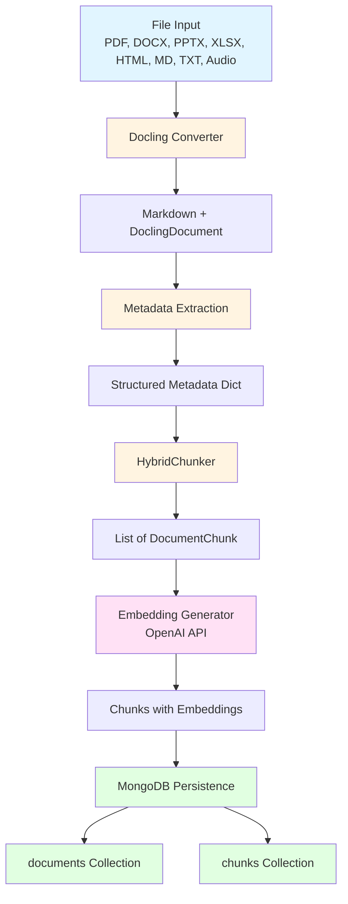
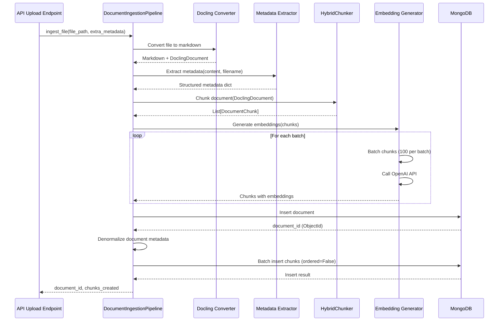

# Ingestion Pipeline Deep Dive

This document provides a comprehensive technical overview of the document ingestion pipeline, covering supported formats, conversion processes, metadata extraction, chunking strategies, embedding generation, and MongoDB persistence.

## Overview

The ingestion pipeline (`src/ingestion/ingest.py`) processes documents from various formats into searchable chunks stored in MongoDB. The pipeline consists of five main stages:

1. **File Reading & Conversion**: Convert documents to markdown using Docling
2. **Metadata Extraction**: Extract structured metadata from headers, filenames, and content
3. **Chunking**: Split documents into semantically coherent chunks
4. **Embedding**: Generate vector embeddings for semantic search
5. **Persistence**: Store documents and chunks in MongoDB with denormalized metadata

## Architecture



## Supported File Formats

The pipeline supports a wide range of document formats:

### Document Formats (via Docling)
- **PDF**: `.pdf` - Portable Document Format
- **Microsoft Office**:
  - Word: `.docx`, `.doc`
  - PowerPoint: `.pptx`, `.ppt`
  - Excel: `.xlsx`, `.xls`
- **Web Formats**: `.html`, `.htm`
- **Markdown**: `.md`, `.markdown` (for HybridChunker)

### Text Formats (direct read)
- **Plain Text**: `.txt` - UTF-8 or Latin-1 encoded

### Audio Formats (via Docling + Whisper ASR)
- **Audio**: `.mp3`, `.wav`, `.m4a`, `.flac` - Transcribed using Whisper Turbo model

### Format Detection

File format is detected by file extension (case-insensitive). The pipeline uses different handlers based on format:

```python
# From src/ingestion/ingest.py:_read_document()
audio_formats = ['.mp3', '.wav', '.m4a', '.flac']
docling_formats = ['.pdf', '.docx', '.doc', '.pptx', '.ppt', 
                   '.xlsx', '.xls', '.html', '.htm', '.md', '.markdown']
```

## Docling Conversion

### Overview

Docling (`docling.document_converter.DocumentConverter`) is used to convert structured documents (PDF, Office formats, HTML) into markdown format while preserving document structure (headings, tables, lists, etc.).

### Conversion Process

1. **DocumentConverter Initialization**: Creates a converter instance with default settings
2. **File Conversion**: Calls `converter.convert(file_path)` which:
   - Parses the document structure
   - Extracts text content
   - Preserves formatting (headings, tables, lists)
   - Handles OCR for scanned PDFs
3. **Markdown Export**: Converts `DoclingDocument` to markdown string via `result.document.export_to_markdown()`

### Audio Transcription

For audio files, the pipeline uses Docling's ASR (Automatic Speech Recognition) pipeline with Whisper Turbo:

```python
# From src/ingestion/ingest.py:_transcribe_audio()
pipeline_options = AsrPipelineOptions()
pipeline_options.asr_options = asr_model_specs.WHISPER_TURBO

converter = DocumentConverter(
    format_options={
        InputFormat.AUDIO: AudioFormatOption(
            pipeline_cls=AsrPipeline,
            pipeline_options=pipeline_options,
        )
    }
)
```

The transcription includes timestamps and is exported as markdown.

### DoclingDocument Object

The converter returns a `DoclingDocument` object that contains:
- **Structured content**: Hierarchical document structure
- **Metadata**: Document-level metadata
- **Export methods**: `export_to_markdown()` for text extraction

This object is passed to the chunker for structure-aware chunking.

### Error Handling

If Docling conversion fails:
1. Logs error with file path
2. Falls back to raw text extraction (for text-based formats)
3. Returns error message as content if all methods fail

## Metadata Extraction

The pipeline extracts metadata from multiple sources using specialized extractors in `src/ingestion/metadata_extractor.py`.

### Extraction Sources

#### 1. Tax Interpretation Header (`extract_tax_interpretation_metadata`)

Extracts structured metadata from Polish tax interpretation document headers (first ~50 lines):

| Field | Description | Example |
|-------|-------------|---------|
| `id_informacji` | Unique document identifier | `"12345"` |
| `kategoria` | Document category | `"Interpretacja indywidualna"` |
| `status` | Document status | `"Aktualna"` |
| `data_publikacji` | Publication date | `"2025-01-15"` |
| `tytul_teza` | **Main question/title** (most important) | `"Czy podatek od..."` |
| `autor` | Author name | `"Jan Kowalski"` |
| `data_wydania` | Issue date | `"2025-01-10"` |
| `sygnatura` | Document signature | `"KDIP2-1.4010.514.2025.2"` |
| `slowa_kluczowe` | Keywords (list) | `["podatek", "VAT", "zwolnienie"]` |

**Pattern Matching**: Uses line-by-line parsing to find field labels (e.g., `"ID informacji:"`) and extract values from subsequent lines.

#### 2. Filename Pattern (`extract_structured_metadata`)

Extracts metadata from structured filename patterns:

**Pattern**: `YYYY-MM-DD_HHMM-[TYPE]-[NUMBER].[VERSION].[YEAR].[REVISION].[AUTHOR].pdf`

**Example**: `2025-11-17_0114-KDIP2-1.4010.514.2025.2.DK.pdf`

| Field | Description | Example |
|-------|-------------|---------|
| `document_date` | Date from filename | `"2025-11-17"` |
| `document_time` | Time from filename | `"0114"` |
| `document_type` | Document type code | `"KDIP2"` or `"KDIB1-3"` (normalized) |
| `document_number` | Document number | `"1.4010.514"` |
| `document_year` | Year | `"2025"` |
| `revision` | Revision number | `"2"` |
| `author` | Author initials | `"DK"` |
| `parsed_from_filename` | Flag | `True` |

**Special Handling**: For `KDIB*` series, the first numeric segment is appended to the type (e.g., `KDIB1-3`).

#### 3. Content Analysis (`extract_outcome_status`, `extract_interpretation_stance`)

Extracts semantic information from document content:

**Outcome Status** (`extract_outcome_status`):
- Scans for patterns indicating success/failure:
  - Successful: `"interpretacja jest korzystna"`, `"stanowisko jest pozytywne"`, etc.
  - Unsuccessful: `"interpretacja jest niekorzystna"`, `"stanowisko jest negatywne"`, etc.
- Returns: `{"outcome_status": "successful" | "unsuccessful", "outcome_paragraphs": [...]}`

**Interpretation Stance** (`extract_interpretation_stance`):
- Classifies document stance:
  - `"positive"`: Stanowisko prawidłowe
  - `"negative"`: Stanowisko nieprawidłowe
  - `"partial"`: Stanowisko w części prawidłowe i w części nieprawidłowe
- Uses normalized Polish text (diacritics removed) for pattern matching
- Returns: `{"stance": "positive" | "partial" | "negative", "evidence": [...]}`

#### 4. Enhanced Title Extraction (`extract_title_enhanced`)

Multi-strategy title extraction with fallbacks:

1. **From metadata `tytul_teza`** (best - actual question/title)
2. **Parse header directly** for `"Tytuł (teza):"` field
3. **Document number + type** from filename metadata
4. **First H2 heading** (skip generic `"Interpretacja indywidualna"`)
5. **Filename** (fallback)

#### 5. Basic Metadata

Always extracted:
- `file_path`: Original file path
- `file_size`: Content length in characters
- `ingestion_date`: ISO datetime of ingestion
- `line_count`: Number of lines
- `word_count`: Number of words
- `section_count`: Number of H2 sections (via `get_section_count()`)

### Metadata Merging

Metadata is merged in this order:
1. Base metadata (file_path, file_size, ingestion_date)
2. Tax interpretation metadata (if applicable)
3. Filename metadata (if pattern matches)
4. YAML frontmatter (if present, for backward compatibility)
5. Content analysis (outcome_status, interpretation_stance)
6. Extra metadata (e.g., `project_id` from API uploads)

## Chunking Strategy

The pipeline uses Docling's `HybridChunker` for intelligent document splitting that respects document structure and token limits.

### Chunking Configuration

```python
@dataclass
class ChunkingConfig:
    chunk_size: int = 1000          # Target characters (fallback)
    chunk_overlap: int = 200        # Character overlap (fallback)
    max_chunk_size: int = 2000      # Maximum chunk size (fallback)
    min_chunk_size: int = 100       # Minimum chunk size (fallback)
    max_tokens: int = 512           # Maximum tokens for embeddings
```

### HybridChunker Features

**Token-Aware**: Uses actual tokenizer (`sentence-transformers/all-MiniLM-L6-v2`) for precise token counting, not character estimates.

**Structure Preservation**: 
- Respects document sections (headings, paragraphs, tables)
- Preserves semantic boundaries
- Includes heading hierarchy in chunk context

**Contextualized Output**: Chunks include parent headings for better context:
```
## Section Title
### Subsection
[Chunk content here]
```

### Chunking Modes

#### 1. Standard HybridChunker (Default)

For most documents:
- Uses `HybridChunker` with `max_tokens=512` (configurable)
- Processes `DoclingDocument` directly
- Creates contextualized chunks with heading hierarchy
- Merges small adjacent chunks (`merge_peers=True`)

#### 2. Section-Aware Chunking (Tax Interpretations)

For Polish tax interpretation documents (detected by metadata):

**Section Types**:
- `header`: Document header/metadata (200 token limit, single chunk)
- `przepis`: Regulation references (400 token limit, single chunk)
- `zagadnienie`: Issue/question section (400 token limit, single chunk)
- `interpretation`: Main interpretation content (800 token limit, HybridChunker)
- `analysis`: Legal analysis sections (800 token limit, HybridChunker)

**Variable Token Limits**: Different sections use different token limits based on their expected content size.

**Section Identification**: Uses `identify_sections()` to find H2 headings and classify section types.

#### 3. Simple Fallback

When `DoclingDocument` is unavailable or HybridChunker fails:
- Character-based sliding window chunking
- Sentence boundary detection
- Configurable overlap

### Chunk Metadata

Each chunk includes:

**Base Metadata**:
- `title`: Document title
- `source`: Document source path
- `chunk_method`: `"hybrid"`, `"section_aware_hybrid"`, or `"simple_fallback"`
- `total_chunks`: Total number of chunks in document
- `token_count`: Actual token count (from tokenizer)
- `chunk_index`: Position in document (0-based)

**Section Metadata** (for section-aware chunks):
- `section_type`: `"header"`, `"przepis"`, `"zagadnienie"`, `"interpretation"`, `"analysis"`
- `section_title`: Section heading text
- `section_index`: Section position in document
- `is_header`: Boolean flag
- `is_main_content`: Boolean flag

**Document Metadata** (denormalized - see Persistence section):
- `project_id`, `document_type`, `document_date`, `id_informacji`, `sygnatura`, `interpretation_stance`, `slowa_kluczowe`, `author`

## Embedding Generation

Embeddings are generated using OpenAI-compatible embedding APIs (configurable via settings).

### Embedding Model

**Default**: `text-embedding-3-small`
- **Dimensions**: 1536
- **Max Tokens**: 8191 per text
- **Provider**: OpenAI (configurable)

**Configuration** (from `src/settings.py`):
- `embedding_model`: Model name (default: `"text-embedding-3-small"`)
- `embedding_api_key`: API key for embedding provider
- `embedding_base_url`: Base URL (default: `"https://api.openai.com/v1"`)
- `embedding_dimension`: Vector dimension (default: 1536)

### Supported Models

| Model | Dimensions | Max Tokens |
|-------|------------|------------|
| `text-embedding-3-small` | 1536 | 8191 |
| `text-embedding-3-large` | 3072 | 8191 |
| `text-embedding-ada-002` | 1536 | 8191 |

### Embedding Process

1. **Batch Processing**: Processes chunks in batches (default: 100 chunks per batch)
2. **Text Truncation**: Truncates text if exceeds max tokens (rough estimation: 4 chars per token)
3. **API Call**: Calls `embeddings.create()` with batch of texts
4. **Vector Storage**: Stores embedding as Python `list[float]` (NOT string!)

### Embedding Metadata

Each embedded chunk includes:
- `embedding`: `list[float]` - Vector representation
- `embedding_model`: Model name used
- `embedding_generated_at`: ISO datetime timestamp

### Error Handling

- Truncates text automatically if too long
- Logs batch progress
- Continues processing even if individual chunks fail (batch processing)

## MongoDB Persistence

The pipeline stores data in two MongoDB collections with a denormalized metadata pattern for efficient filtering.

### Collection Structure

#### Documents Collection (`documents`)

**Schema**:
```python
{
    "_id": ObjectId,                    # MongoDB document ID
    "title": str,                       # Document title
    "source": str,                      # Relative file path
    "content": str,                     # Full document content (markdown)
    "metadata": dict,                  # Complete metadata dictionary
    "created_at": datetime              # Ingestion timestamp
}
```

**Purpose**: Source of truth for complete documents. Used for:
- Document retrieval by ID
- Full document content access
- Metadata joins with chunks

#### Chunks Collection (`chunks`)

**Schema**:
```python
{
    "_id": ObjectId,                    # MongoDB chunk ID
    "document_id": ObjectId,            # FK to documents._id
    "content": str,                     # Chunk text content
    "embedding": list[float],          # Vector embedding (1536-dim for default model)
    "chunk_index": int,                 # Position in document (0-based)
    "metadata": dict,                   # Enhanced metadata (see below)
    "token_count": int,                 # Token count for this chunk
    "created_at": datetime              # Ingestion timestamp
}
```

**Purpose**: Searchable units for RAG queries. Used for:
- Vector similarity search
- Text search
- Metadata filtering
- Citation generation

### Metadata Denormalization

**Why Denormalize?**: Enables efficient filtering without joins. Key document metadata is copied into each chunk's `metadata` field.

**Denormalized Fields** (from `src/ingestion/ingest.py:_save_to_mongodb()`):
- `project_id`: Project association (if document belongs to a project)
- `document_type`: Document type code (e.g., `"KDIP2"`, `"KDIB1-3"`)
- `document_date`: Document date from filename
- `id_informacji`: Document ID (for tax interpretations)
- `sygnatura`: Document signature
- `interpretation_stance`: `"positive"`, `"partial"`, or `"negative"`
- `slowa_kluczowe`: Keywords array
- `author`: Author name/initials

**Chunk-Specific Metadata** (also in `metadata`):
- `title`, `source`, `chunk_method`, `total_chunks`, `token_count`
- `section_type`, `section_title`, `section_index` (for section-aware chunks)
- `embedding_model`, `embedding_generated_at`

### Batch Insertion

Chunks are inserted using `insert_many()` with `ordered=False`:
- **Partial Success**: Continues inserting even if some chunks fail
- **Performance**: Faster than individual inserts
- **Error Handling**: Logs failures but doesn't stop pipeline

### Required MongoDB Indexes

#### Vector Search Index (Atlas UI)

**Index Name**: `vector_index` (configurable via `mongodb_vector_index` setting)

**Configuration**:
- **Collection**: `chunks`
- **Field**: `embedding`
- **Type**: Vector Search
- **Dimensions**: 1536 (for `text-embedding-3-small`)
- **Similarity**: Cosine (default)

**Creation**: Must be created in MongoDB Atlas UI (not via code)

#### Text Search Index (Atlas UI)

**Index Name**: `text_index` (configurable via `mongodb_text_index` setting)

**Configuration**:
- **Collection**: `chunks`
- **Field**: `content`
- **Type**: Text Search

**Creation**: Must be created in MongoDB Atlas UI (not via code)

#### Metadata Indexes (via `scripts/create_indexes.py`)

**Documents Collection**:
- `metadata.document_type` (ascending)
- `metadata.document_date` (ascending)
- `metadata.author` (ascending)
- `metadata.id_informacji` (ascending)
- `metadata.sygnatura` (ascending)
- `metadata.slowa_kluczowe` (ascending, array index)
- Composite: `(metadata.document_type, metadata.document_date)`

**Chunks Collection**:
- `metadata.section_type` (ascending)
- `metadata.document_type` (ascending)
- `metadata.document_date` (ascending)
- `metadata.id_informacji` (ascending)
- `metadata.slowa_kluczowe` (ascending, array index)
- Composite: `(metadata.section_type, metadata.document_type)`

**Note**: These indexes are created via `scripts/create_indexes.py` script, not in Atlas UI.

### Data Flow



## Configuration

### Environment Variables

Required environment variables (via `.env` file):

```bash
# MongoDB
MONGODB_URI=mongodb+srv://...
MONGODB_DATABASE=rag_db

# Embeddings
EMBEDDING_API_KEY=sk-...
EMBEDDING_MODEL=text-embedding-3-small
EMBEDDING_BASE_URL=https://api.openai.com/v1
```

### Pipeline Configuration

```python
@dataclass
class IngestionConfig:
    chunk_size: int = 1000          # Target chunk size (characters)
    chunk_overlap: int = 200        # Overlap between chunks
    max_chunk_size: int = 2000       # Maximum chunk size
    max_tokens: int = 512            # Max tokens per chunk for embeddings
```

### Settings

Configuration loaded from `src/settings.py`:
- MongoDB connection settings
- Collection names
- Embedding model configuration
- Index names

## Error Handling & Resilience

### Conversion Errors
- **Docling failures**: Falls back to raw text extraction
- **Audio transcription failures**: Returns error message as content
- **Unsupported formats**: Logs warning, skips file

### Chunking Errors
- **HybridChunker failures**: Falls back to simple character-based chunking
- **Section identification failures**: Falls back to standard HybridChunker
- **Empty content**: Returns empty chunk list

### Embedding Errors
- **API failures**: Logs error, continues with next batch
- **Text truncation**: Automatically truncates if exceeds max tokens
- **Batch failures**: Partial success allowed (`ordered=False`)

### MongoDB Errors
- **Connection failures**: Raises exception, stops pipeline
- **Insert failures**: Logs error, continues (for batch inserts)
- **Index errors**: Logged but doesn't stop ingestion

## Performance Considerations

### Batch Processing
- **Embeddings**: Processed in batches of 100 (configurable)
- **MongoDB inserts**: All chunks inserted in single batch

### Token Counting
- Uses actual tokenizer (not character estimates)
- Prevents embedding API errors from oversized chunks

### Denormalization Trade-offs
- **Pros**: Fast filtering without joins, efficient queries
- **Cons**: Increased storage, metadata updates require chunk updates

### Async Operations
- All MongoDB operations are async (`AsyncMongoClient`)
- Embedding API calls are async
- Pipeline supports concurrent document processing (future enhancement)

## Usage Examples

### CLI Usage

```bash
# Ingest all documents from documents/ folder
python -m src.ingestion.ingest --documents documents/

# Custom chunk size
python -m src.ingestion.ingest --chunk-size 1500 --chunk-overlap 300

# Dry run (no MongoDB writes)
python -m src.ingestion.ingest --dry-run

# Verbose logging
python -m src.ingestion.ingest --verbose
```

### Programmatic Usage

```python
from src.ingestion.ingest import DocumentIngestionPipeline, IngestionConfig

config = IngestionConfig(
    chunk_size=1000,
    chunk_overlap=200,
    max_tokens=512
)

pipeline = DocumentIngestionPipeline(
    config=config,
    documents_folder="documents",
    clean_before_ingest=False,
    dry_run=False
)

# Ingest single file (used by API)
result = await pipeline.ingest_file(
    "path/to/document.pdf",
    extra_metadata={"project_id": "..."}
)

# Ingest all documents
results = await pipeline.ingest_documents()

await pipeline.close()
```

## Related Documentation

- **User Guide**: `docs/how-to/HOW_DOCUMENT_INGESTION_WORKS.md`
- **MongoDB Patterns**: `.claude/reference/mongodb-patterns.md`
- **Metadata Extraction**: `src/ingestion/metadata_extractor.py`
- **Chunking**: `src/ingestion/chunker.py`
- **Embedding**: `src/ingestion/embedder.py`
- **Settings**: `src/settings.py`
