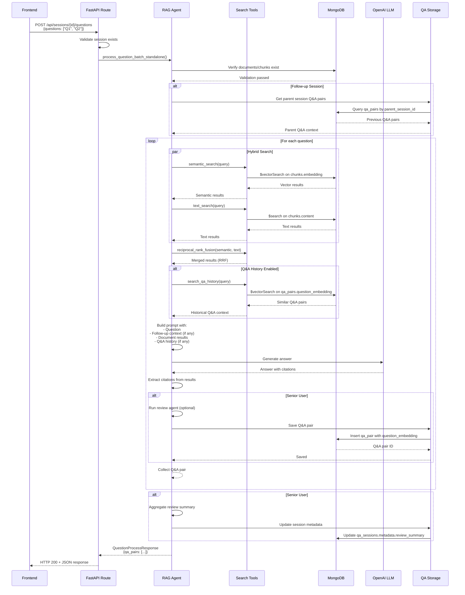

# RAG Agent Flow Deep Dive

This document provides a technical deep dive into the RAG (Retrieval-Augmented Generation) agent pipeline, covering hybrid search, citation handling, Q&A history search, and follow-up context injection.

## Overview

The RAG agent (`src/agent.py`) orchestrates question answering by:
1. **Searching the knowledge base** using hybrid search (vector + text + RRF)
2. **Searching Q&A history** for similar successful answers
3. **Injecting follow-up context** when processing follow-up sessions
4. **Generating answers** with citations using LLM
5. **Tracking citations** for display and export

The agent is built on **Pydantic AI** with state management via `RAGState` and uses MongoDB Atlas for vector search, text search, and data storage.

## Architecture Components

### Core Files

- **`src/agent.py`**: Main agent implementation with tools and question processing
- **`src/tools.py`**: Search tools (semantic, text, hybrid, Q&A history)
- **`src/prompts.py`**: System prompts and context templates
- **`src/reasoning.py`**: Question decomposition and result merging helpers
- **`src/services/qa_storage.py`**: Q&A pair and session storage
- **`src/dependencies.py`**: Agent dependencies (MongoDB, embeddings)

### Agent State

```python
class RAGState(BaseModel):
    """Shared state for the RAG agent with search history tracking."""
    search_history: List[Dict] = []
    """History of previous searches for iterative refinement."""
```

The agent uses `StateDeps[RAGState]` to maintain search history across tool calls, enabling iterative refinement.

## Hybrid Search Pipeline

### Overview

Hybrid search combines **semantic (vector) search** and **text (keyword) search** using **Reciprocal Rank Fusion (RRF)** to merge results. This approach works on all MongoDB Atlas tiers, including M0 (free tier).

### Search Types

#### 1. Semantic Search (`semantic_search`)

**Purpose**: Find documents by semantic similarity using vector embeddings.

**Implementation** (`src/tools.py:86-220`):
- Generates query embedding using OpenAI embeddings API
- Uses MongoDB `$vectorSearch` aggregation stage
- Searches `chunks.embedding` field with cosine similarity
- Applies metadata filters after vector search (project_id, document_type, author, date range, keywords, section_type)
- Returns top N results ordered by `vectorSearchScore`

**MongoDB Pipeline**:
```python
pipeline = [
    {
        "$vectorSearch": {
            "index": "vector_index",  # Atlas vector search index
            "queryVector": query_embedding,  # List[float]
            "path": "embedding",
            "numCandidates": 100,  # Search space (10x limit)
            "limit": match_count * 2  # Over-fetch for filtering
        }
    },
    {"$match": metadata_filter},  # Apply filters after vector search
    {"$lookup": {...}},  # Join with documents collection
    {"$project": {...}}  # Format results
]
```

**Key Features**:
- Over-fetches results (2x) when metadata filters are applied to compensate for post-filtering
- Graceful degradation: returns empty list on error (doesn't crash)
- Supports project scoping via `metadata.project_id`

#### 2. Text Search (`text_search`)

**Purpose**: Find documents by keyword matching, fuzzy matching, and phrase matching.

**Implementation** (`src/tools.py:222-359`):
- Uses MongoDB Atlas Search `$search` operator
- Searches `chunks.content` field with fuzzy matching (maxEdits: 2, prefixLength: 3)
- Applies metadata filters after text search
- Returns top N results ordered by `searchScore`

**MongoDB Pipeline**:
```python
pipeline = [
    {
        "$search": {
            "index": "text_index",  # Atlas Search index
            "text": {
                "query": query,
                "path": "content",
                "fuzzy": {
                    "maxEdits": 2,
                    "prefixLength": 3
                }
            }
        }
    },
    {"$match": metadata_filter},  # Apply filters
    {"$lookup": {...}},  # Join with documents
    {"$project": {...}}  # Format results
]
```

**Key Features**:
- Fuzzy matching handles typos and variations
- Works on all Atlas tiers (no M10+ requirement)
- Graceful degradation on errors

#### 3. Reciprocal Rank Fusion (`reciprocal_rank_fusion`)

**Purpose**: Merge multiple ranked result lists into a unified ranking.

**Algorithm** (`src/tools.py:362-433`):
```python
def reciprocal_rank_fusion(
    search_results_list: List[List[SearchResult]],
    k: int = 60  # Standard RRF constant
) -> List[SearchResult]:
    """
    RRF Score Formula:
    RRF_score(d) = Σ(1 / (k + rank_i(d)))
    
    Where:
    - d = document/chunk
    - rank_i(d) = position of d in result list i
    - k = constant (default: 60, standard in literature)
    """
```

**Process**:
1. For each document appearing in any result list:
   - Calculate RRF contribution: `1 / (k + rank)` for each list
   - Sum contributions across all lists
2. Sort documents by combined RRF score (descending)
3. Deduplicate by `chunk_id` (keeps highest score if duplicate)

**Why RRF?**:
- Simple and effective (no tuning required)
- Works well across diverse datasets
- Standard k=60 performs well empirically
- Better than simple score averaging (handles rank position)

#### 4. Hybrid Search (`hybrid_search`)

**Purpose**: Combine semantic and text search using RRF.

**Implementation** (`src/tools.py:436-647`):
1. **Concurrent Execution**: Runs both searches in parallel using `asyncio.gather()`
2. **Error Handling**: If one search fails, uses the other (graceful degradation)
3. **RRF Merging**: Merges results using `reciprocal_rank_fusion()`
4. **Top N Selection**: Returns top `match_count` results by combined RRF score

**Flow Diagram**:
```
Query
  ├─→ Semantic Search (vector) ─┐
  │                              ├─→ RRF Merge ─→ Top N Results
  └─→ Text Search (keyword) ────┘
```

**Performance**:
- Over-fetches 2x requested count for better RRF results
- Logs timing metrics (semantic_time, text_time, rrf_time, total_time)
- Falls back to semantic-only if hybrid fails

**Metadata Filtering**:
All search types support filtering by:
- `project_id`: Scope to specific project
- `document_type`: Filter by document type (e.g., "KDIP2", "KDIB1-3")
- `author`: Filter by author initials (e.g., "DK", "AZ")
- `date_from` / `date_to`: Filter by document date range
- `keywords`: Filter by keywords (matches any in array)
- `section_type`: Filter by section type (e.g., "przepis", "zagadnienie")

## Citation Handling

### Citation Tracking

Citations are tracked using a module-level dictionary (`_citation_tracker`) that maps call IDs to citation metadata:

```python
_citation_tracker: Dict[str, List[Dict[str, str]]] = {}
```

**Process** (`src/agent.py:231-288`):
1. **Document Deduplication**: Uses `OrderedDict` to track unique documents by `document_id`
2. **Citation Numbering**: Assigns sequential citation numbers (1, 2, 3, ...) to unique documents
3. **Metadata Extraction**: Extracts citation metadata:
   - `citation_number`: Sequential number
   - `title`: Document title
   - `source`: Document source path
   - `document_id`: MongoDB ObjectId
   - `id_informacji`: Tax interpretation ID (if available)
   - `sygnatura`: Document signature (if available)
   - `document_type`: Document type (if available)
   - `document_date`: Document date (if available)
4. **Call ID Generation**: Generates UUID for each tool call
5. **Storage**: Stores citation metadata in `_citation_tracker[call_id]`
6. **Response Formatting**: Includes citation markers `[1]`, `[2]`, etc. in search results

### Citation Format in Search Results

Search results are formatted with inline citation markers:

```
Found 3 relevant documents:

--- Document [1]: Title (relevance: 0.85) ---
Content text here [1]

--- Document [2]: Title (relevance: 0.78) ---
Content text here [2]

<CITATION_TRACKER_ID:uuid>
```

The `<CITATION_TRACKER_ID:uuid>` marker is hidden from the LLM but extracted by the CLI/API layer to retrieve citation metadata.

### Citation Extraction in Answer Generation

**Process** (`src/agent.py:1137-1152`):
1. **Document Results**: Citations are extracted from `doc_results` (SearchResult objects)
2. **Deduplication**: Uses `unique_docs` dictionary to track unique documents
3. **Citation Building**: Creates citation dictionaries with:
   - `citation_number`: Sequential number
   - `title`: Document title
   - `source`: Document source
   - `document_id`: MongoDB ObjectId
   - `similarity`: Relevance score
4. **Storage**: Citations are saved with Q&A pairs in MongoDB (`qa_pairs.citations`)

### Citation Display

Citations are displayed in the frontend (`frontend/src/components/QABlock.tsx`) and exported in various formats (`src/services/export_service.py`). The citation format can be configured via `settings.show_full_citations`:
- **Full**: `[1] Title - Source: path/to/file.pdf`
- **Simple**: `[1] Title`

## Q&A History Search

### Purpose

Search historical Q&A pairs to find similar successful answers that can inform the current answer generation.

### Implementation (`src/tools.py:765-960`)

**Function**: `search_qa_history()`

**Process**:
1. **Query Embedding**: Generates embedding for the search query
2. **Vector Search**: Uses MongoDB `$vectorSearch` on `qa_pairs.question_embedding`
3. **Filtering**: Applies filters:
   - `outcome_status`: Filter by "successful" or "unsuccessful" (default: "successful")
   - `user_role`: Filter by "junior" or "senior"
4. **Session Lookup**: Joins with `qa_sessions` collection to get session metadata
5. **Result Formatting**: Returns Q&A pairs with:
   - Question and answer text
   - Citations from original answer
   - Session name and user role
   - Similarity score

**MongoDB Pipeline**:
```python
pipeline = [
    {
        "$vectorSearch": {
            "index": "vector_index",
            "queryVector": query_embedding,
            "path": "question_embedding",  # Search on question embeddings
            "numCandidates": 100,
            "limit": match_count * 2
        }
    },
    {"$match": {"outcome_status": "successful"}},  # Filter by outcome
    {"$lookup": {"from": "qa_sessions", ...}},  # Join session info
    {"$match": {"session_info.user_role": user_role}},  # Filter by role
    {"$project": {...}}  # Format results
]
```

### Usage in Answer Generation

**Context Injection** (`src/agent.py:1021-1044`):
1. **Q&A History Search**: Searches for similar successful Q&A pairs (top 3)
2. **Formatting**: Formats historical Q&A using `QA_HISTORY_PROMPT` template:
   ```
   ## Similar Successful Q&A from History
   
   ### Historical Q&A #1 (similarity: 0.85)
   **Question:** [question]
   **Answer:** [answer excerpt]
   **Citations:** [count] source(s)
   **Session:** [session name]
   ```
3. **Prompt Injection**: Includes formatted history in answer generation prompt
4. **Instructions**: LLM is instructed to:
   - Use historical answers as reference
   - Adapt information to current question context
   - NOT copy verbatim
   - Consider similarity scores

**Prompt Template** (`src/prompts.py:139-153`):
```python
QA_HISTORY_PROMPT = """
## Similar Successful Q&A from History

The following questions and answers from previous successful sessions are similar to the current question:

{qa_history}

**Instructions:**
- Use these successful answers as reference, but adapt them for the current question
- Do NOT copy verbatim - adapt the information to match the current question's specific context
- If the historical answer is highly relevant (similarity > 0.8), you can reference similar approaches but ensure your answer addresses the current question's nuances
- Consider the similarity scores to gauge how relevant each historical answer is
- Combine insights from historical answers with new document search results when appropriate
- Cite historical Q&A when you're building upon or referencing previous successful approaches
"""
```

### Configuration

- **Default Match Count**: 3 historical Q&A pairs
- **Outcome Filter**: Defaults to "successful" (can be overridden)
- **User Role Filter**: Optional (filters by session's user_role)
- **Enable/Disable**: Controlled via `include_history` parameter (default: `True`)

## Follow-Up Context Injection

### Purpose

When processing questions in a follow-up session, inject context from the previous round's Q&A pairs to help the agent learn from prior shortcomings and improve answers.

### Follow-Up Session Structure

**Session Metadata** (`src/services/qa_storage.py:400-415`):
```python
{
    "session_name": "Parent Session (Round 2)",
    "metadata": {
        "round_number": 2,
        "parent_session_id": "parent_session_id",
        "previous_qa_summary": "...",
        "previous_qa_pairs_count": 5
    }
}
```

### Context Retrieval (`src/agent.py:836-881`)

**Process**:
1. **Session Detection**: Checks if current session has `metadata.parent_session_id`
2. **Parent Q&A Retrieval**: Fetches Q&A pairs from parent session using `qa_storage.get_parent_session_qa_pairs()`
3. **Formatting**: Formats previous Q&A pairs:
   ```
   ### Previous Q&A #1 [successful]
   **Question:** [question]
   **Previous Answer:** [answer excerpt]
   **Citations:** [count] source(s)
   ```
4. **Template Application**: Uses `FOLLOW_UP_CONTEXT_PROMPT` template to build context

**Prompt Template** (`src/prompts.py:162-184`):
```python
FOLLOW_UP_CONTEXT_PROMPT = """
## IMPORTANT: Follow-up Session Context (Round {round_number})

This is a follow-up session building upon a previous round. Use the prior Q&A as context and improve on it where needed.

### Previous Round Q&A Pairs

The following questions and answers from the previous round need improvement:

{previous_qa_pairs}

### Instructions for Answer Generation

- **Review the previous answers** and identify what was missing, incorrect, or insufficient
- **Do NOT repeat the same approach** if it didn't work in the previous round
- **Provide more comprehensive, accurate, or detailed answers** than before
- **Consider different angles** or additional information sources that weren't explored previously
- **If previous answers were partially correct**, build upon them rather than starting over completely
- **Address any gaps** that remained after the previous round
- **Ensure your answer fully addresses** the user's question this time

Use this context to inform your answer generation, but still search the knowledge base for current, accurate information.
"""
```

### Answer Generation Flow with Follow-Up Context

**Prompt Structure** (`src/agent.py:1052-1083`):
```
Question: [current question]

[FOLLOW_UP_CONTEXT_PROMPT if follow-up session]

## Document Search Results:
[document context]

[QA_HISTORY_PROMPT if Q&A history enabled]

[Final instructions with citation requirements]
```

**Order of Context**:
1. **Question**: Current question text
2. **Follow-Up Context**: Previous round's Q&A (if follow-up session)
3. **Document Results**: Current search results from knowledge base
4. **Q&A History**: Similar successful historical Q&A (if enabled)
5. **Instructions**: Final instructions for answer generation

**Key Behavior**:
- Follow-up context is injected **FIRST** (before document results) to emphasize learning from previous round
- Agent is instructed to **not repeat failed approaches**
- Agent should **build upon** partially correct answers
- Agent must still **search the knowledge base** for current information

## Question Processing Flow

### Standalone Processing (`process_question_batch_standalone`)

**Function**: `src/agent.py:715-1335`

**Flow**:
1. **Validation**: Checks database has documents/chunks/embeddings
2. **Follow-Up Context**: Retrieves parent session Q&A if follow-up session
3. **For Each Question**:
   a. **Document Search**: Hybrid search on knowledge base (project-scoped if session has project_id)
   b. **Q&A History Search**: Vector search on historical Q&A pairs (if enabled)
   c. **Answer Generation**: LLM generates answer with:
      - Document context
      - Q&A history context (if enabled)
      - Follow-up context (if follow-up session)
   d. **Citation Extraction**: Extracts citations from document results
   e. **Review Agent**: Runs review agent for senior users (optional)
   f. **Save Q&A Pair**: Saves to MongoDB if senior user
4. **Session Review Summary**: Aggregates review data for session (senior users)

### Question Processing Sequence Diagram



### Agent Tool Processing (`process_question_batch`)

**Function**: `src/agent.py:1338-1379`

Wrapper that calls `process_question_batch_standalone()` - allows agent to process questions via tool calls.

### Search Tools Available to Agent

1. **`search_knowledge_base`**: Single hybrid search with metadata filtering
2. **`multi_search_knowledge_base`**: Parallel searches for multiple queries (for decomposed questions)
3. **`decompose_question`**: Analyzes question complexity and suggests sub-questions
4. **`refine_search`**: Iteratively refines search queries based on previous results
5. **`process_question_batch`**: Processes multiple questions (wrapper)

## Session and Project Scoping

### Project Scoping

**Automatic Scoping** (`src/agent.py:153-171`):
- If `session_id` is provided and no explicit `project_id`, the agent auto-resolves `project_id` from session
- All searches are then scoped to the session's project via `metadata.project_id` filter
- Prevents cross-project data leakage

**Manual Scoping**:
- `project_id` parameter can be explicitly provided to any search tool
- Overrides session-based scoping

### Session Scoping

**Q&A History Search**:
- Can filter by `user_role` (from session)
- Can filter by `outcome_status` (successful/unsuccessful)
- Results include session metadata (session_name, user_role, company_info)

**Q&A Pair Storage**:
- Q&A pairs are linked to session via `session_id` (ObjectId reference)
- Session metadata includes project_id, user_role, company_info

## MongoDB Collections and Indexes

### Required Collections

1. **`chunks`**: Document chunks with embeddings
   - Fields: `_id`, `content`, `embedding`, `document_id`, `metadata`
   - Indexes: Vector search index on `embedding`, Text search index on `content`

2. **`documents`**: Source documents metadata
   - Fields: `_id`, `title`, `source`, `metadata`
   - Used for lookup joins

3. **`qa_sessions`**: Q&A sessions
   - Fields: `_id`, `session_name`, `user_role`, `project_id`, `metadata`
   - Metadata includes: `round_number`, `parent_session_id`, `company_info`

4. **`qa_pairs`**: Q&A pairs with question embeddings
   - Fields: `_id`, `session_id`, `question`, `question_embedding`, `original_answer`, `final_answer`, `citations`, `outcome_status`
   - Indexes: Vector search index on `question_embedding` (for Q&A history search)

### Required Atlas Indexes

**Vector Search Index** (`vector_index`):
- Type: Vector Search
- Collection: `chunks`
- Field: `embedding`
- Dimensions: 1536 (for text-embedding-3-small)
- Similarity: cosine

**Text Search Index** (`text_index`):
- Type: Atlas Search
- Collection: `chunks`
- Field: `content`
- Analyzer: Standard (default)

**Q&A History Vector Index**:
- Uses same `vector_index` but searches `qa_pairs.question_embedding`
- Must support vector search on multiple collections (or use separate index)

## Error Handling and Graceful Degradation

### Search Errors

**Semantic Search Failure**:
- Returns empty list (doesn't crash)
- Logs error with details
- Hybrid search continues with text search only

**Text Search Failure**:
- Returns empty list (doesn't crash)
- Logs error with details
- Hybrid search continues with semantic search only

**Both Searches Fail**:
- Returns empty list
- Logs error
- Falls back to semantic-only search as last resort

### Q&A History Search Errors

**OperationFailure** (e.g., missing index):
- Returns empty list
- Logs error with error code
- Answer generation continues without history context

**Invalid Filter Parameters**:
- Returns empty list
- Logs warning
- Answer generation continues without history context

### Follow-Up Context Errors

**Parent Session Not Found**:
- Logs warning
- Continues without follow-up context
- Answer generation proceeds normally

**Parent Q&A Retrieval Failure**:
- Logs warning
- Continues without follow-up context
- Answer generation proceeds normally

## Performance Considerations

### Search Performance

- **Concurrent Execution**: Semantic and text searches run in parallel
- **Over-Fetching**: Fetches 2x requested count for better RRF results
- **Connection Pooling**: Uses async MongoDB client with connection pooling
- **Embedding Caching**: Embeddings are generated per query (no caching currently)

### Answer Generation Performance

- **Prompt Length**: Monitors prompt length (logs warning if excessive)
- **LLM Timeout**: Uses default LLM timeout (no explicit timeout set)
- **Batch Processing**: Processes questions sequentially (not parallelized)

### Optimization Opportunities

1. **Embedding Caching**: Cache query embeddings for repeated queries
2. **Parallel Question Processing**: Process multiple questions concurrently
3. **Result Caching**: Cache search results for identical queries
4. **Connection Reuse**: Reuse MongoDB connections across tool calls

## Configuration

### Settings (`src/settings.py`)

**Search Configuration**:
- `default_match_count`: Default number of results (default: 10)
- `max_match_count`: Maximum allowed results (default: 50)
- `default_text_weight`: Text weight for hybrid search (not used with RRF)

**Agentic RAG Configuration**:
- `enable_question_decomposition`: Enable question decomposition (default: True)
- `enable_iterative_refinement`: Enable iterative search refinement (default: True)
- `max_search_iterations`: Maximum refinement iterations (default: 3)

**Citation Configuration**:
- `show_full_citations`: Show full citations with source path (default: False)

## Logging and Observability

### Search Logging

All search operations log:
- Query text (truncated to 200 chars)
- Result counts
- Timing metrics (ms)
- Top similarity scores
- Filter parameters

### Answer Generation Logging

Logs:
- Question index and text
- Prompt length
- Document result counts
- Q&A history counts
- Follow-up context presence
- Answer length
- Citation counts
- Processing time

### Error Logging

All errors include:
- Error message and type
- Query/question context
- Timing information
- Full stack traces (for exceptions)

## Testing Considerations

### Unit Tests

- Test search tools independently (`test_scripts/test_search.py`)
- Test RRF merging logic
- Test citation extraction
- Test metadata filtering

### Integration Tests

- Test end-to-end question processing (`test_scripts/test_rag_pipeline.py`)
- Test follow-up session context injection (`test_scripts/test_follow_up_sessions.py`)
- Test Q&A history search (`test_scripts/test_qa_history_search.py`)

### Performance Tests

- Measure search latency
- Measure answer generation time
- Test concurrent search performance
- Test with large result sets

## Future Enhancements

1. **Multi-Hop Reasoning**: Chain multiple searches for complex questions
2. **Citation Verification**: Verify citations are actually used in answer
3. **Answer Quality Scoring**: Score answer quality before saving
4. **Search Result Caching**: Cache results for identical queries
5. **Parallel Question Processing**: Process multiple questions concurrently
6. **Advanced RRF**: Weighted RRF with learned weights
7. **Hybrid Embeddings**: Use multiple embedding models for better coverage
